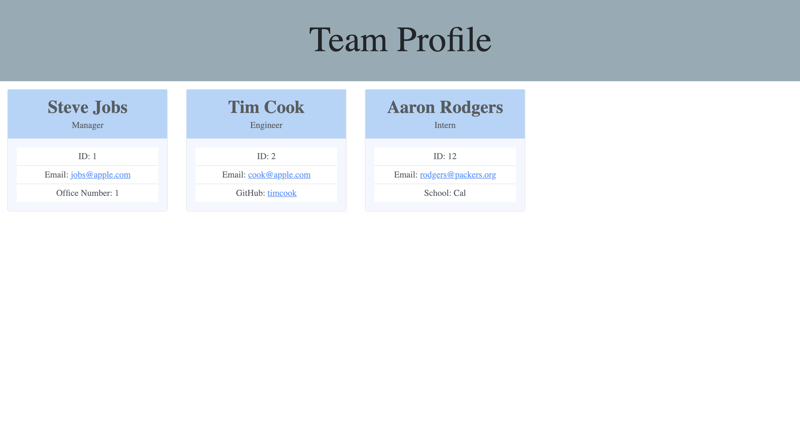

# team_profile_generator

<!-- TABLE OF CONTENTS -->
<details open="open">
  <summary>Table of Contents</summary>
  <ol>
    <li>
      <a href="#about-the-project">About The Project</a>
      <ul>
        <li><a href="#built-with">Built With</a></li>
      </ul>
    </li>
    <li>
      <a href="#getting-started">Getting Started</a>
    </li>
    <li><a href="#code-snippet">Code-Snippet</a></li>
    <li><a href="#license">License</a></li>
    <li><a href="#contact">Contact</a></li>
    <li><a href="#acknowledgements">Acknowledgements</a></li>
  </ol>
</details>


<!-- ABOUT THE PROJECT -->
## About The Project



For this application, I had to create a team profile generator. The user will be prompted questions in their terminal and from there, a index.html file will be generated. Per usual, this tested my knowledge with node.js and made me do a bunch of research to deliver the best application to the user. Of course, this was a fun to make and look to implementing an html to the application!

The websites I used to help create the application are listed below in the <a href="#acknowledgements">acknowledgements</a>.

### Built With

I used <a href="https://code.visualstudio.com/">Visual Studio Code</a> to finish creating the application. The files were provided by the professor and I just had to finish the build.


<!-- GETTING STARTED -->
## Getting Started

To get started with this application, you need to open the file in VS Code or something similar. From then, open your terminal, either in VS Code or on your computer and navigate to the README generator file. From then, use the command:
```
cd Develop
```
then, the following
```
npm i
```
then, the following
```
node index.js
```
After that, go through the prompts and once you are finshed, hit done and an "index.html" will generate!


<!-- USAGE EXAMPLES -->
## Code Snippets

Below is the function I used to generate an html file. The code snippets starts with the prompt from inquirer and the response from that will console.log the report and then create a file called "index.html". The next part is the 'generateHTML' where it is a template literal for creating the template for the HTML.
```
function init() {
    inquirer
    .prompt(questions)
    .then((response) => {
        console.log(response)
        writeToFile("README.md", generateHTML(response));
    });
}
```


<!-- LICENSE -->
## License

Distributed under the MIT License. See `LICENSE` for more information.


<!-- CONTACT -->
## Contact
Sami Khawja: Skhawja11@gmail.com


## Project Links
Project Link: [GitHub](https://github.com/samikhawja/team_profile_generator)


<!-- ACKNOWLEDGEMENTS -->
## Acknowledgements
* Taylor Hackbart
* [W3Schools](https://www.w3schools.com/)
* [StackOverflow](https://stackoverflow.com/)
* [Mozilla](https://developer.mozilla.org/en-US/docs/Web/JavaScript)
* [JQuery](https://jquery.com/)